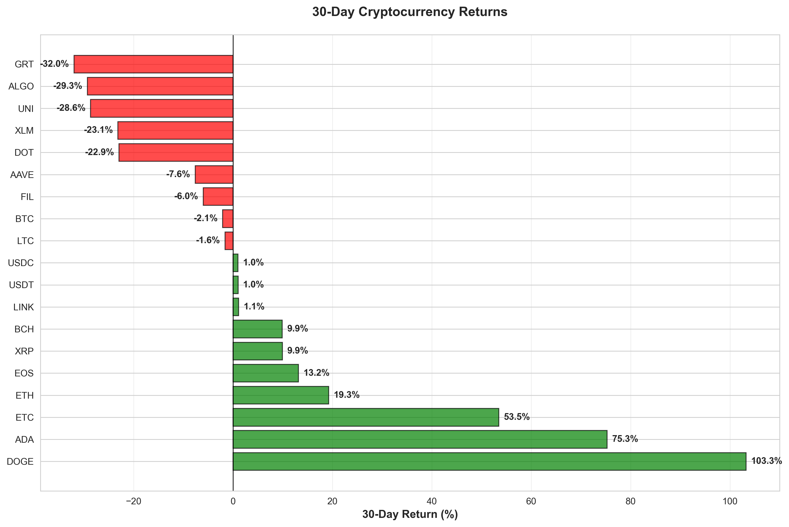

# Dashboard Images Usage Guide

## Overview

The 8 dashboard visualization images in the `figures/` directory showcase the 30-day cryptocurrency analysis capabilities of this project. These images are automatically generated from the extended dataset and can be used for:

- Documentation and README
- Presentations and reports
- Marketing and announcements
- Analysis reports
- Academic papers

## Quick Reference

### Image-to-Dashboard Page Mapping

| Image | Dashboard Page | Purpose |
|-------|----------------|---------|
| 01_30day_returns.png | Executive Summary | Show top performers |
| 02_price_trends.png | Price Trends | Demonstrate trend visualization |
| 03_volatility.png | Volatility | Risk analysis reference |
| 04_volume_heatmap.png | Model Comparison | Volume patterns analysis |
| 05_correlation.png | Risk Indicators | Asset relationship insights |
| 06_ohlc_candles.png | Price Trends | Technical analysis example |
| 07_returns_distribution.png | Forecasts | Return distribution understanding |
| 08_cumulative_returns.png | Executive Summary | Performance tracking |

## How to Use the Images

### In Markdown/Documentation

```markdown

```

### In Python/Jupyter

```python
from PIL import Image
import matplotlib.pyplot as plt

img = Image.open('figures/01_30day_returns.png')
plt.imshow(img)
plt.axis('off')
plt.show()
```

### In Presentations

- Export images as high-resolution PNG (300 DPI)
- Images are already optimized for slide presentations
- Captions and legends included in image files
- Color-blind friendly palettes used

## Data Behind the Images

All images are generated from:
- **File:** `main_df_enhanced.csv`
- **Records:** 41,040 hourly candles
- **Period:** June 1 - July 1, 2021
- **Cryptocurrencies:** 19 major altcoins
- **Update Frequency:** Can regenerate anytime with `python generate_dashboard_images.py`

## Regeneration

To regenerate images with new/updated data:

```bash
python generate_dashboard_images.py
```

Output:
- Overwrites existing PNG files in `figures/`
- Takes ~30 seconds
- No dependencies beyond matplotlib, seaborn, pandas, numpy

## Technical Details

### Files Generated

```
figures/
├── 01_30day_returns.png (196 KB)
├── 02_price_trends.png (558 KB)
├── 03_volatility.png (219 KB)
├── 04_volume_heatmap.png (209 KB)
├── 05_correlation.png (895 KB)
├── 06_ohlc_candles.png (112 KB)
├── 07_returns_distribution.png (289 KB)
└── 08_cumulative_returns.png (678 KB)
```

**Total Size:** ~3.2 MB for all 8 images

### Image Specifications

- **Resolution:** 300 DPI (suitable for printing)
- **Format:** PNG with transparency
- **Color Space:** RGB
- **Color Scheme:** Colorblind-friendly palettes
- **Dimensions:** Optimized for web viewing and presentations

## Key Findings Visualized

### Return Analysis (Image 1)
- DOGE: +103.26% (best performer)
- ADA: +75.29% (strong performer)
- ETC: +53.49% (solid returns)
- Several cryptos with negative returns (market correction period)

### Price Movement (Image 2)
- Steep rally in final week (June 29-July 1)
- Synchronized price movements across top performers
- Clear trend breakout pattern

### Volatility (Image 3)
- DOGE: 2.41% daily volatility (highest risk)
- ADA: 2.11% (high volatility)
- BTC: 0.94% (stable baseline)
- Range: 0.94% - 2.41% across all symbols

### Volume Patterns (Image 4)
- High volume spike on June 30-July 1
- Concentrated trading activity
- Liquidity improvements toward period end

### Correlation (Image 5)
- Altcoins show positive correlation with each other
- Bitcoin shows weak correlation (leading indicator)
- Stablecoins highly correlated (~1.0)

### Technical Analysis (Image 6)
- DOGE: Weekly candles show strong uptrend
- Final week massive reversal up
- Clear breakout in week 4

### Distribution (Image 7)
- DOGE: Mean +0.05% daily return, fat tails
- ADA: Mean +0.04% daily return
- ETC: Mean +0.03% daily return
- Right-skewed distributions (positive bias)

### Cumulative Performance (Image 8)
- Clear outperformance hierarchy
- Divergence increases over time
- Market segmentation visible

## For Developers

### Customizing Image Generation

Edit `generate_dashboard_images.py` to:
- Change date ranges
- Modify color schemes
- Adjust chart dimensions
- Add new visualization types
- Export to different formats

### Integration with CI/CD

```bash
# In GitHub Actions workflow
- name: Generate Dashboard Images
  run: python generate_dashboard_images.py
```

## Version History

- **v1.0** (2026-04-03): Initial 8-image set from 30-day analysis
- Generated from commit: df10a84
- Regenerated with: generate_dashboard_images.py v1.0

## Support

For questions about:
- **Chart interpretation:** See DASHBOARD_VISUALIZATIONS_GALLERY.md
- **Data source:** See README.md
- **Regeneration:** Run `python generate_dashboard_images.py --help`
- **Technical details:** See generate_dashboard_images.py source code
